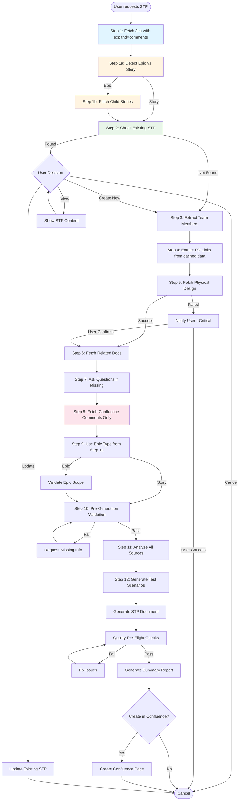

# Software Test Plan (STP) Generation Guide

**📌 Content Organization:** When modifying this skill, follow the content organization guidelines in [README.md](README.md). Keep SKILL.md concise - move detailed implementation to REFERENCE.md, templates to TEMPLATES.md, and examples to EXAMPLES.md.

## 📋 Quick Reference Card

**Essential Values:**
- **Cloud ID**: `97dda470-29da-47e8-b3a8-ee663b322db9`
- **Confluence Space**: `CD` (Core R&D)
- **STP Parent Folder ID**: `4555964418`
- **Page Title Format**: `STP - [EPIC-KEY] - [Epic Title]`

**Common CQL Queries:**
- **Search STP**: Use multi-strategy search (4 fallback strategies) - see Step 2a and [REFERENCE.md](REFERENCE.md#confluence-stp-search-strategies)
- **Search Physical Design**: See [REFERENCE.md](REFERENCE.md#physical-design-search-and-extraction) for CQL query syntax

**Critical Rules:**
- ✅ **Step 2**: Check existing STP in BOTH locations (Confluence AND local files) before proceeding. Never overwrite local files - use versioned filenames (_v1, _v2, etc.)
- ✅ **Step 3**: Extract team members from Jira FIRST, before Physical Design
- ✅ **Step 4-5**: Physical Design is essential - search BOTH Jira AND Confluence. If not found or fetch fails, STOP and ask user for options (provide link OR proceed without)
- ✅ **Step 12-13**: Test scenario tables MUST include all 5 columns: Test Case | Test Steps | Expected Result | **Test Level** | **Priority**
- ✅ **Step 8**: Detect conflicts and resolve by recency (comments > documents)
- ✅ **Step 9**: For Epics, validate scope - filter stories from other epics
- ✅ **Step 15**: Use exact Summary Report template - no variations

**Reference Files:**
- 📚 **[REFERENCE.md](REFERENCE.md)** - Detailed rules, validation, troubleshooting, and procedures
- 📋 **[TEMPLATES.md](TEMPLATES.md)** - Templates and formatting
- 💡 **[EXAMPLES.md](EXAMPLES.md)** - Examples and patterns

## Workflow Diagram



## ⚠️ MANDATORY WORKFLOW ENFORCEMENT

**CRITICAL: These rules MUST be followed in EVERY STP generation. Do NOT skip or modify these steps.**

### Rule 1: Existing STP Check (Step 2) - MANDATORY STOP POINT
- Check for existing STP in BOTH locations (Confluence AND local files) before proceeding
- Complete both checks before notifying user - do not stop after finding one location
- If found in either location, STOP and ask user what to do - never assume user wants to create new
- Use versioned filenames if local files exist - never overwrite

### Rule 2: Summary Report Format - MANDATORY TEMPLATE
- Use exact template format from [TEMPLATES.md](TEMPLATES.md#summary-report-template)
- Do not create custom summaries or skip sections - use "TBD" or "Not available" if data missing

### Rule 3: Sequential Step Execution
- Execute steps in order (1-16) - do not skip or combine steps unless explicitly allowed

### Rule 4: Physical Design Handling - User Choice Required
- Search for Physical Design in BOTH locations (Jira links AND Confluence) in Step 4
- If not found, STOP and ask user in Step 7 with options: (a) Provide Physical Design link, or (b) Proceed without
- Never proceed without user's explicit choice

**If you find yourself deviating from these rules, STOP and re-read the relevant section.**

## Quick Start

When a user wants to create an STP, follow this workflow:

1. **Fetch Jira epic/story** (Step 1) - Get all available information automatically with `expand=comments`
2. **Detect Epic vs Story** (Step 1a) - Detect immediately after Step 1
3. **Fetch Child Stories** (Step 1b) - If Epic detected, fetch child stories early (can parallelize with Step 2)
4. **Check for Existing STP** (Step 2) - Check BOTH Confluence AND local files before notifying user. Stop early when results found
5. **Extract team members from Jira** (Step 3) - Extract from Jira fields ONLY, BEFORE Physical Design. See [REFERENCE.md](REFERENCE.md#-team-member-extraction)
6. **Extract Physical Design links** (Step 4) - Search BOTH Jira links (from Step 1) AND Confluence. If not found, STOP and ask user
7. **Fetch Physical Design** (Step 5) - Only if Step 4 found page ID. If fetch fails, ask user for options
8. **Fetch Related Documents** (Step 6) - Check for other Confluence links (use cached data from Step 1)
9. **Ask questions** (Step 7) - Only for missing or unclear information
10. **Fetch Comments and Detect Conflicts** (Step 8) - Only fetch Confluence comments (Jira comments from Step 1)
11. **Detect Epic vs Story** (Step 9) - Use type from Step 1a, child stories from Step 1b
12. **Pre-Generation Validation** (Step 10) - Ensure all required information present
13. **Analyze All Sources** (Step 11) - Combine information (validate Epic scope during analysis)
14. **Generate Test Scenarios** (Step 12) - Extract unit, integration, functional, regression tests with Test Level and Priority columns
15. **Generate STP document** (Step 13) - Follow template from [TEMPLATES.md](TEMPLATES.md), ensure test tables include all 5 columns
16. **Quality Pre-Flight Checks** (Step 14) - Validate before Confluence creation
17. **Generate Summary Report** (Step 15) - Use exact template from [TEMPLATES.md](TEMPLATES.md#summary-report-template)
18. **Create Confluence Page** (Step 16) - Optionally create with user approval

**For Bulk Operations:** See [EXAMPLES.md](EXAMPLES.md#bulk-operations) for Epic with multiple stories workflow

## Reference Documentation

- **[REFERENCE.md](REFERENCE.md)** - Epic Scope Validation, Team Member Extraction, Error Recovery, API Retry Logic, Conflict Detection, Troubleshooting, Confluence Page Creation
- **[TEMPLATES.md](TEMPLATES.md)** - Document templates, formatting guidelines, icon reference, quality checks, summary report template
- **[EXAMPLES.md](EXAMPLES.md)** - Example workflows, common patterns, key success factors

## Workflow Steps

### Step 1: Fetch Jira Epic/Story (Do This First)

**CRITICAL: This is the most important API call. If this fails, STP generation cannot proceed.**

Fetch immediately when epic/story key is provided using `mcp_atlassian_getJiraIssue` with:
- **`expand=comments`** parameter to fetch comments in same call (saves API call in Step 8)
- Retry logic (3 attempts with exponential backoff)

See [REFERENCE.md](REFERENCE.md#api-call-retry-logic-and-error-handling) for detailed retry logic and error handling.

### Step 1a: Detect Epic vs Story Type (IMMEDIATELY AFTER STEP 1)

**CRITICAL: Check `issuetype.name` field from Step 1 response:**
- **If "Epic"**: Set `isEpic = true`, proceed to Step 1b
- **If "Story"**: Set `isEpic = false`, skip Step 1b, continue to Step 2

**This information will be used to optimize Step 9 (no need to re-detect) and enable early child story fetching.**

### Step 1b: Fetch Child Stories (IF EPIC DETECTED IN STEP 1A)

**Only execute if Step 1a detected Epic (`isEpic = true`):**
- Use JQL query: `parent = [EPIC-KEY]` with `mcp_atlassian_searchJiraIssuesUsingJql`
- Filter out automation test implementation stories immediately
- Store child stories for use in Step 9 (Epic scope validation)
- Can be parallelized with Step 2 to save time

### Step 2: Check for Existing STP Documents

**📋 CHECKPOINT: MANDATORY STOP POINT - Do NOT proceed to Step 3 until user chooses an option.**

**Check BOTH locations (Confluence AND local files) before notifying user:**
1. **Confluence** (Step 2a): Search for existing STP pages by epic/story key with "STP" or "Software Test Plan" in title
2. **Local Files** (Step 2b): Check for files matching pattern `STP*[EPIC-KEY]*.md`
3. **After both checks** (Step 2c): Notify user with ALL findings from both locations

**Confluence Search (Step 2a) - Multi-Strategy Search:**

**CRITICAL: Execute strategies in order, STOP immediately when STP results found:**

1. **Strategy 1:** Execute query `space = CD AND type = page AND title ~ "[EPIC-KEY]"`, filter results for STP pages
   - **If STP found:** STOP immediately - do NOT execute remaining strategies
   - **If no STP found:** Continue to Strategy 2

2. **Strategy 2:** Execute only if Strategy 1 found no STP. Same query as Strategy 1, filter for STP in title OR text
   - **If STP found:** STOP immediately - do NOT execute remaining strategies
   - **If no STP found:** Continue to Strategy 3

3. **Strategy 3:** Execute only if Strategies 1-2 found no STP. Same query, broader filtering
   - **If STP found:** STOP immediately - do NOT execute Strategy 4
   - **If no STP found:** Continue to Strategy 4

4. **Strategy 4:** Execute only if Strategies 1-3 found no STP. Parent folder search

**After execution:** Combine results, remove duplicates by page ID, report findings.

**For detailed tool specifications, CQL queries, tool call examples, troubleshooting, and error handling, see [REFERENCE.md](REFERENCE.md#confluence-stp-search-strategies).**

**Local Files Search (Step 2b):**
- Search for local files matching pattern: `STP*[EPIC-KEY]*.md`
- See [REFERENCE.md](REFERENCE.md#local-file-handling-and-versioning) for detailed search implementation

**After Both Checks Complete (Step 2c):**
- **If found in either location:** STOP and ask user what to do. Show results from BOTH locations (even if one is empty)
- **Confluence STP Display Format:** For each STP found, display only:
  - Page name as clickable link: `[Page Title](URL)`
  - Author: `Author: [Name]`
  - Date: `Created: [Date] / Updated: [Date]`
  - Example: `[CORE-160634 - Automating Reconciliation...](https://global-e.atlassian.net/wiki/spaces/CD/pages/6317244576/...) - Author: Denis Hural - Created: Sep 25, 2025 / Updated: Oct 06, 2025`
- **If user chooses "Create new" and local files exist:** Use versioned filename - never overwrite. See [REFERENCE.md](REFERENCE.md#local-file-handling-and-versioning)
- **If not found:** Continue with workflow. Use base filename `STP_[EPIC-KEY].md` for first local file

**For data extraction from Confluence response and formatting details, see [REFERENCE.md](REFERENCE.md#confluence-stp-search-strategies).**

**For detailed Confluence search strategies and troubleshooting, see [REFERENCE.md](REFERENCE.md#confluence-stp-search-strategies).**

### Step 3: Extract Team Members from Jira (MUST DO THIS FIRST)

**📋 CHECKPOINT: Verify team members extracted BEFORE proceeding to Step 4 (Physical Design fetch).**

**CRITICAL: Extract team members from Jira Epic/Story fields ONLY, BEFORE fetching Physical Design. DO NOT extract from Physical Design documents.**

See [REFERENCE.md](REFERENCE.md#-team-member-extraction) for complete extraction rules, field mapping, and validation checkpoints.

### Step 4: Extract Physical Design Links and Timeline from Jira

**📋 CHECKPOINT: MANDATORY - Search BOTH locations before proceeding. If not found, STOP and ask user.**

**CRITICAL: Physical Design is ESSENTIAL. You MUST search in BOTH locations (Jira links AND Confluence) before proceeding. If not found, STOP and ask user for options.**

**Extract Physical Design Links (MUST CHECK BOTH):**

**4a. Search Jira Story/Epic (FIRST):**
- Use comments already fetched in Step 1 (with expand=comments) - no additional API call needed
- Search story description and comments (from Step 1) for Confluence links (patterns: `wiki/spaces/.../pages/[PAGE-ID]`)
- Extract page IDs from URLs
- If found: Note page ID and proceed to Step 5
- If NOT found: Continue to Step 4b (MANDATORY - do NOT skip)

**4b. Search Confluence (SECOND - MANDATORY if not found in Jira):**
- **MANDATORY: If Step 4a found nothing, you MUST execute this search before concluding Physical Design doesn't exist**
- Search Confluence using CQL query for Physical Design documents: `space = CD AND type = page AND title ~ "Physical Design" AND text ~ [EPIC-KEY]`
- See [REFERENCE.md](REFERENCE.md#physical-design-search-and-extraction) for CQL query syntax
- If found: Extract page ID and proceed to Step 5
- Epic scope: If Epic-level found, use as source of truth. If only Initiative-level found, extract Epic-specific sections only
- **CRITICAL: If not found in BOTH locations: STOP IMMEDIATELY - DO NOT proceed to Step 5, Step 6, or any later steps. Go directly to Step 7 to ask user for options.**

**📋 MANDATORY CHECKPOINT AFTER STEP 4:**
- **If Physical Design page ID found (from either 4a or 4b):** Proceed to Step 5
- **If NO Physical Design found in BOTH locations:** **STOP - Go to Step 7 immediately to ask user for options (provide link OR proceed without Physical Design).**

**For detailed Confluence search tool calls and CQL query syntax, see [REFERENCE.md](REFERENCE.md#physical-design-search-and-extraction).**

**Extract Timeline Information:**
- **Sprint**: Extract from sprint field
- **Fix Version**: Extract from fix version field
- **Due Date**: Extract from due date field
- **If missing**: Ask user for timeline/sprint information

### Step 5: Fetch Physical Design Automatically (MANDATORY)

**📋 MANDATORY CHECKPOINT BEFORE THIS STEP:**
- **VERIFY**: Physical Design page ID was found in Step 4 (either from Jira links OR Confluence search)
- **If NO page ID found in Step 4:** **DO NOT execute this step. STOP immediately and go to Step 7 to ask user.**
- **If page ID found:** Proceed with fetch below

**CRITICAL: Physical Design document is ESSENTIAL. This step ONLY executes if Step 4 found a Physical Design page ID.**

**Fetch Process (only if page ID found in Step 4):**
- Fetch Physical Design with retry logic (3 attempts with exponential backoff)
- If all retries fail: **STOP and ask user for options** - Go to Step 7 to ask: "⚠️ Physical Design document could not be fetched after 3 attempts. Error: [error details]. Would you like to: (a) Provide a different Physical Design page ID/URL, or (b) Proceed with STP generation without Physical Design?"
- If fetch succeeds: Use as scope source (Epic-level) or extract Epic-specific sections only (Initiative-level)

**CRITICAL: If you reach this step without a Physical Design page ID from Step 4, you have made an error. STOP immediately and go to Step 7.**

See [REFERENCE.md](REFERENCE.md#api-call-retry-logic-and-error-handling) for detailed retry logic and error handling.

### Step 6: Fetch Related Documents

Check for other Confluence links in (use cached data from Step 1 to avoid re-parsing):
- Story description (from Step 1 - already cached)
- Story comments (from Step 1 with expand=comments - already cached)
- Physical design document itself

Fetch each related document automatically.

### Step 7: Ask Questions Only for Missing Information

Use the AskQuestion tool ONLY for information that:
- Was NOT found in Jira story
- Is unclear or ambiguous
- Needs user confirmation

**Question Categories (only ask if missing):**
- **Physical Design**: **CRITICAL** - If you reach Step 7 and Physical Design was not found in Step 4 (neither Jira links nor Confluence search) OR fetch failed in Step 5, **STOP and ask user with options**:
  ```
  ⚠️ Physical Design document was not found or could not be fetched.
  
  I searched in:
  - Jira story description/comments for links
  - Confluence using CQL query
  
  What would you like to do?
  a) Provide Physical Design page ID or URL (I will fetch it and use it for STP generation)
  b) Proceed with STP generation without Physical Design (note: STP will be less comprehensive without technical implementation details)
  c) Cancel STP generation
  
  Please choose an option (a, b, or c).
  ```
- **Team Members**: If unclear, ask who is QA Engineer/Product Owner
- **Timeline**: If missing, ask for sprint/timeline information
- **Test Strategy**: Test types, TestRail section, automation framework
- **Scope and Risks**: Out of scope areas, additional risks

**For detailed question phases, see [EXAMPLES.md](EXAMPLES.md).**

### Step 8: Fetch Comments and Detect Conflicts

**📋 CHECKPOINT: Extract all timestamps and resolve conflicts by recency before proceeding.**

**CRITICAL: Always check comments (Jira story comments from Step 1, Confluence inline/footer comments) to check for recent updates and conflicts. Prioritize by recency: Comments > Story > Physical Design. Surface conflicts to user and apply most recent information consistently.**

**Fetch Confluence comments (Jira comments already available from Step 1 with expand=comments):**
- Fetch Confluence footer comments: `mcp_atlassian_getConfluencePageFooterComments`
- Fetch Confluence inline comments: `mcp_atlassian_getConfluenceInlineComments` (if available - tool may not be available in all MCP configurations)

**Note:** If inline comments tool is not available, proceed with footer comments only. Inline comments are optional for conflict detection.

See [REFERENCE.md](REFERENCE.md#conflict-detection-and-resolution) for detailed conflict detection patterns, timestamp extraction, and resolution rules.

### Step 9: Detect Epic vs Story Type

**📋 CHECKPOINT: For Epics, validate scope and filter stories from other epics. Filter automation test stories.**

**CRITICAL: Use Epic/Story type from Step 1a. Child stories already fetched in Step 1b (if Epic). For Epics:**
1. Check for Epic-level Physical Design first (use as scope source if found)
2. **Use child stories from Step 1b (already fetched) - no need to fetch again**
3. Filter out automation test implementation stories (if not already filtered in Step 1b)
4. Validate story scope - filter stories from other epics
5. Ask user preference: Consolidated / Separate / Selective STPs

**For Story:** Check if part of Epic, reference epic in STP if applicable.

See [REFERENCE.md](REFERENCE.md#-epic-scope-validation) for detailed Epic scope validation rules.

### Step 10: Pre-Generation Validation Checklist

**📋 CHECKPOINT: All validation items must pass before proceeding to Step 11.**

**CRITICAL: Validate all required information before generating STP. Check: Epic/Story key valid, title/description present, acceptance criteria found, Epic scope validated (if Epic), Physical Design fetched, team members identified, timeline available, conflicts resolved, test scenarios extractable (3-5 minimum).**

**CRITICAL VALIDATION ITEMS (MUST PASS):**
- ✅ **Physical Design status**: **MANDATORY CHECK** - Verify Physical Design status:
  - **If Physical Design was found and fetched successfully:** ✅ Proceed
  - **If Physical Design was not found OR fetch failed:** Check if user explicitly chose to proceed without Physical Design in Step 7:
    - **If user chose option (a) - provide link:** Wait for user to provide link, then fetch and proceed
    - **If user chose option (b) - proceed without:** ✅ Proceed (note limitation in STP)
    - **If user has NOT been asked yet:** **STOP immediately** and go to Step 7 to ask user for options
    - **If user chose option (c) - cancel:** Stop STP generation
- ✅ Epic/Story key valid, title/description present, acceptance criteria found
- ✅ Epic scope validated (if Epic), team members identified, timeline available
- ✅ Conflicts resolved, test scenarios extractable (3-5 minimum)

**If validation fails:** List missing items clearly, ask user to provide missing information. **DO NOT proceed until validation passes, especially for Physical Design.**

### Step 11: Analyze All Sources

**CRITICAL: Epic Scope Validation During Analysis:**
- See [REFERENCE.md](REFERENCE.md#-epic-scope-validation)
- Ensure all extracted content belongs to THIS Epic only

Combine information from all sources (after conflict resolution) to extract:
- **Requirements**: What needs to be tested (using most recent information)
- **Test Scenarios**: Specific test cases and edge cases
- **Technical Details**: Implementation specifics
- **Dependencies**: Other features/systems involved
- **Risks**: Potential issues or concerns

**Epic Scope Validation:** Ensure all extracted content belongs to THIS Epic only. See [REFERENCE.md](REFERENCE.md#-epic-scope-validation)

### Step 12: Intelligent Test Scenario Generation

**📋 CHECKPOINT: For Epics, validate each test scenario belongs to Epic scope only. Generate unit, integration, functional, and regression tests.**

**CRITICAL: Generate comprehensive test scenarios intelligently from all sources. Extract from Acceptance Criteria (positive/negative/edge cases), Physical Design (integration points, API endpoints, functions), and Story Description (user flows, business rules). Organize into logical sections with appropriate test levels (Unit, Integration, Functional, Performance, Security, Regression, E2E) and priorities (Must, Should, Nice to Have).**

**MANDATORY: All test scenario tables MUST use 5-column format:** Test Case | Test Steps | Expected Result | **Test Level** | **Priority**. See [TEMPLATES.md](TEMPLATES.md#test-scenarios-format) for format details and assignment guidelines.

For Epics, validate scope for each scenario. See [EXAMPLES.md](EXAMPLES.md#test-scenario-extraction) for detailed extraction patterns and examples.

### Step 13: Generate STP Document

**📋 CHECKPOINT: Before generating, verify all 12 previous steps completed, test scenarios generated, conflicts resolved, Epic scope validated.**

**Generate the STP following the template structure. See [TEMPLATES.md](TEMPLATES.md) for detailed section guidance, formatting, and icon reference.**

**Key Requirements:**
- Follow document structure from [TEMPLATES.md](TEMPLATES.md#document-structure-with-icons)
- Include all 11 required sections with proper icons
- **CRITICAL: Test scenario tables MUST include all 5 columns:** Test Case | Test Steps | Expected Result | **Test Level** | **Priority** (see [TEMPLATES.md](TEMPLATES.md#test-scenarios-format))
- Use formatting guidelines from [TEMPLATES.md](TEMPLATES.md#formatting-guidelines)
- Include Document Metadata section with skill version and generation date

**Local File Naming:** Never overwrite existing files - use versioned filename. See [REFERENCE.md](REFERENCE.md#local-file-handling-and-versioning)

### Step 14: Quality Pre-Flight Checks

**📋 CHECKPOINT: Run quality checks before Confluence creation.**

**CRITICAL: Run these checks before creating Confluence page. See [TEMPLATES.md](TEMPLATES.md#quality-pre-flight-checks) for complete checklist.**

**Quick Checklist:**
- [ ] All 11 sections present and populated
- [ ] **Test scenario tables include all 5 columns:** Test Case | Test Steps | Expected Result | Test Level | Priority
- [ ] No duplicate test scenarios (check within and across sections)
- [ ] Test cases renumbered sequentially after duplicate removal (if any)
- [ ] All icons properly formatted
- [ ] Epic scope validated (if Epic)
- [ ] All links valid
- [ ] No placeholder text remaining

**If checks fail:** Fix issues automatically if possible, ask user for clarification on issues that can't be auto-fixed. Do NOT create Confluence page until all checks pass.

**For complete quality checklist and duplicate detection process, see [TEMPLATES.md](TEMPLATES.md#quality-pre-flight-checks).**

### Step 15: Generate Summary Report

**📋 CHECKPOINT: Use exact template format - no variations.**

**MANDATORY: You MUST use the exact template format from [TEMPLATES.md](TEMPLATES.md#summary-report-template). DO NOT create custom summaries or variations.**

**Key Requirements:**
- Copy template structure EXACTLY
- Include ALL sections (use "TBD" or "Not available" if data missing)
- Verify counts match between sections
- Calculate and show generation time
- Use consistent status indicators (✅, ⚠️, ❌)

**For complete template and requirements, see [TEMPLATES.md](TEMPLATES.md#summary-report-template).**

### Step 16: Create Confluence Page (Optional)

**📋 CHECKPOINT: Verify no existing STP before creating (should already be checked in Step 2).**

**After generating the STP content, offer to create the Confluence page. See [REFERENCE.md](REFERENCE.md#confluence-page-creation) for detailed process.**

**Quick Process:**
1. Verify no existing STP (should already be checked in Step 2)
2. Get parent folder and create/update page
3. Verify creation/update and provide URL

**For detailed Confluence page creation process, tool calls, and error handling, see [REFERENCE.md](REFERENCE.md#confluence-page-creation).**

## Bulk Operations

**For Epic with multiple stories, see [EXAMPLES.md](EXAMPLES.md#bulk-operations) for detailed workflow and options.**

**Quick Options:**
- **Option 1**: Consolidated STP covering all stories
- **Option 2**: Separate STPs for each story
- **Option 3**: Selective STPs for specific stories only

**Always filter out automation test implementation stories before processing.**

## Additional Resources

- **[REFERENCE.md](REFERENCE.md)** - Epic Scope Validation, Team Member Extraction, Error Recovery, API Retry Logic, Conflict Detection, Troubleshooting
- **[TEMPLATES.md](TEMPLATES.md)** - Document templates, formatting guidelines, icon reference, quality checks, summary report template
- **[EXAMPLES.md](EXAMPLES.md)** - Example workflows, common patterns, key success factors

**Tools:** Atlassian MCP (`mcp_atlassian_*`), Naboo Search (`mcp_naboo-search_Naboo`)

---

## For Contributors

When modifying content, follow guidelines in [README.md](README.md). Keep SKILL.md under 500 lines, move detailed content to appropriate files (REFERENCE.md, TEMPLATES.md, EXAMPLES.md).
